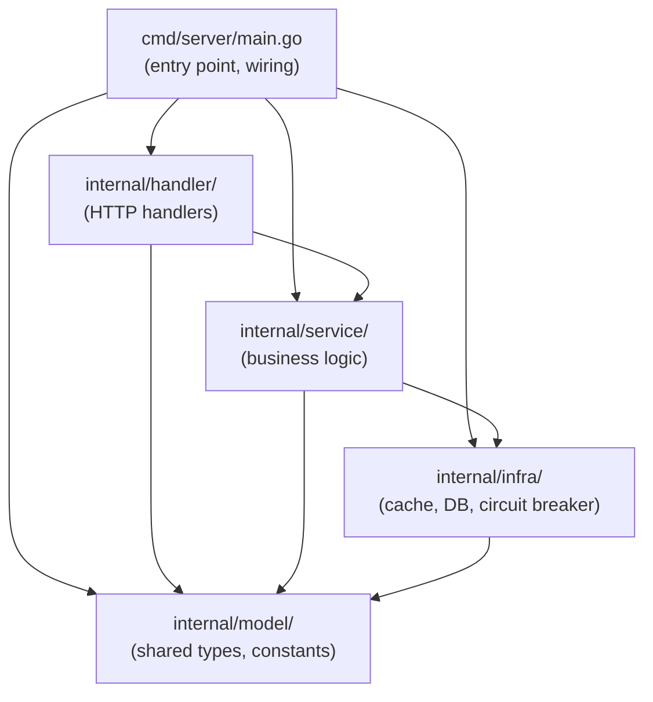

# Design Document: Go Project Layout Restructuring

## Overview

This design describes the migration of the myfi-backend Go codebase from a flat single-package layout (`package main` with 30+ files in `backend/`) to the official Go "Server project" layout. The restructuring introduces four internal packages (`handler`, `service`, `infra`, `model`) under `internal/`, a dedicated entry point at `cmd/server/main.go`, and replaces all package-level global variables with explicit dependency injection via a `Handlers` struct.

The migration is a pure refactoring — zero behavior change. All API endpoints, JSON response shapes, HTTP status codes, and test behavior remain identical.

### Key Design Decisions

1. **Handlers struct for DI**: A single `handler.Handlers` struct holds all service dependencies. The entry point constructs it and passes it to route registration. This replaces the 11 package-level `var` declarations and the `init()` function in `market.go`.

2. **Model package for cross-package types**: Types referenced by more than one package (e.g., `AssetType`, `TransactionType`, `ICBSector`, `CompoundingFrequency`, request/response DTOs) move to `internal/model/`. Types used only within a single package stay in that package.

3. **init() → explicit main()**: The `init()` function in `market.go` that initializes all global services is replaced by explicit construction in `cmd/server/main.go` with proper error handling.

4. **Test files co-located**: Each test file moves with its source file. `testhelper_test.go` moves to `internal/testutil/` as a shared test helper package since it's used by multiple test files across `service/`. The `testdata/` directory moves to `internal/service/testdata/` alongside the property tests that use it.

5. **Migration order**: infra → model → service → handler → cmd/server → tests → cleanup. This order ensures each layer compiles before its dependents are moved.

## Architecture



### Dependency Direction (Acyclic)

```
cmd/server → handler → service → infra → model
                ↘        ↘         ↘
                model    model     model
```

No package imports a package above it. `model` imports zero internal packages. `infra` imports only `model`. This guarantees no circular imports.

### Target Directory Tree

```
backend/
├── go.mod                          (module: myfi-backend, unchanged)
├── go.sum
├── cmd/
│   └── server/
│       └── main.go                 (package main — wiring only)
├── internal/
│   ├── handler/
│   │   ├── market.go               (market data HTTP handlers)
│   │   ├── crypto.go               (crypto HTTP handlers)
│   │   ├── news.go                 (news HTTP handlers)
│   │   └── agent.go                (AI chat HTTP handlers)
│   ├── service/
│   │   ├── price_service.go
│   │   ├── crypto_service.go
│   │   ├── gold_service.go
│   │   ├── fx_service.go
│   │   ├── savings_tracker.go
│   │   ├── watchlist_service.go
│   │   ├── screener_service.go
│   │   ├── sector_service.go
│   │   ├── commodity_service.go
│   │   ├── fund_service.go
│   │   ├── macro_service.go
│   │   ├── market_data_service.go
│   │   ├── portfolio_engine.go
│   │   ├── performance_engine.go
│   │   ├── comparison_engine.go
│   │   ├── transaction_ledger.go
│   │   ├── asset_registry.go
│   │   ├── crypto_service_test.go
│   │   ├── gold_service_test.go
│   │   ├── fx_service_test.go
│   │   ├── price_service_test.go
│   │   ├── portfolio_engine_test.go
│   │   ├── portfolio_engine_property_test.go
│   │   ├── transaction_ledger_test.go
│   │   ├── asset_registry_test.go
│   │   ├── savings_tracker_test.go
│   │   ├── checkpoint_price_services_test.go
│   │   └── testdata/
│   │       └── rapid/              (property test data)
│   ├── infra/
│   │   ├── cache.go
│   │   ├── database.go
│   │   ├── circuit_breaker.go
│   │   ├── rate_limiter.go
│   │   ├── data_source_router.go
│   │   └── data_source_router_test.go
│   ├── model/
│   │   ├── asset_types.go          (AssetType, ValidAssetTypes, ValidateAssetType)
│   │   ├── transaction_types.go    (TransactionType, ValidTransactionTypes, ValidateTransactionType)
│   │   ├── sector_types.go         (ICBSector, SectorTrend, SectorNameMap, AllICBSectors, etc.)
│   │   ├── savings_types.go        (CompoundingFrequency, ValidCompoundingFrequencies, etc.)
│   │   ├── data_category.go        (DataCategory constants, SourcePreference)
│   │   ├── price_types.go          (PriceQuote, OHLCVBar, FXRate, GoldPriceResponse, CryptoPriceResponse, CoinGeckoResponse)
│   │   ├── market_types.go         (ListingData, CompanyData, FinancialReportData, TradingStatistics, MarketStatistics, ValuationMetrics, etc.)
│   │   ├── handler_types.go        (ChatRequest, ModelsRequest, RSS, Channel, Item, ScreenerStock)
│   │   └── portfolio_types.go      (Transaction, Asset, SavingsAccount, PortfolioSummary, HoldingDetail, etc.)
│   └── testutil/
│       └── testhelper.go           (setupPostgresTestDB — package testutil)
```

## Components and Interfaces

### 1. `cmd/server/main.go`

Responsibilities:
- Initialize database via `infra.InitDB()`
- Construct `infra.Cache`, `infra.DataSourceRouter`, `infra.CircuitBreaker`, `infra.RateLimiter`
- Construct all services: `service.NewFXService(...)`, `service.NewGoldService(...)`, etc.
- Construct `handler.Handlers` struct with all service dependencies
- Set up Gin router, CORS middleware, register all routes via `handler.RegisterRoutes(r, h)`
- Call `r.Run(":8080")`

```go
// cmd/server/main.go
package main

import (
    "log"
    "myfi-backend/internal/handler"
    "myfi-backend/internal/infra"
    "myfi-backend/internal/service"
)

func main() {
    // Initialize infrastructure
    db, err := infra.InitDB()
    if err != nil {
        log.Fatalf("Database initialization failed: %v", err)
    }
    defer infra.CloseDB(db)

    cache := infra.NewCache()
    router, err := infra.NewDataSourceRouter()
    if err != nil {
        log.Fatalf("Data source router initialization failed: %v", err)
    }

    // Initialize services
    fxSvc := service.NewFXService(cache, router.RateLimiter(), infra.NewCircuitBreaker(3, 60*time.Second))
    goldSvc, err := service.NewGoldService(cache, router.RateLimiter())
    // ... remaining service construction ...

    // Initialize handlers
    h := &handler.Handlers{
        DataSourceRouter: router,
        FXService:        fxSvc,
        // ... all service fields ...
    }

    // Register routes and start
    r := handler.SetupRouter(h)
    log.Println("Starting server on :8080")
    if err := r.Run(":8080"); err != nil {
        log.Fatalf("Server failed to start: %v", err)
    }
}
```

### 2. `handler.Handlers` Struct

Replaces all 11 package-level global variables from `market.go`:

```go
// internal/handler/handlers.go
package handler

type Handlers struct {
    VnstockClient    *vnstock.Client
    DataSourceRouter *infra.DataSourceRouter
    FXService        *service.FXService
    SharedCache      *infra.Cache
    GoldService      *service.GoldService
    PriceService     *service.PriceService
    SectorService    *service.SectorService
    MarketDataService *service.MarketDataService
    FundService      *service.FundService
    CommodityService *service.CommodityService
    MacroService     *service.MacroService
}
```

Handler functions become methods on `*Handlers`:

```go
// Before (flat layout):
func handleMarketQuote(c *gin.Context) { ... dataSourceRouter.FetchRealTimeQuotes(...) }

// After (handler package):
func (h *Handlers) HandleMarketQuote(c *gin.Context) { ... h.DataSourceRouter.FetchRealTimeQuotes(...) }
```

### 3. Route Registration

```go
// internal/handler/routes.go
func SetupRouter(h *Handlers) *gin.Engine {
    r := gin.Default()
    r.Use(CORSMiddleware())

    r.GET("/api/health", HandleHealth)
    r.GET("/api/metrics/rate-limits", h.HandleRateLimitMetrics)
    r.GET("/api/market/quote", h.HandleMarketQuote)
    // ... all routes ...
    return r
}
```

### 4. `infra.DataSourceRouter` — Exported Fields

Currently `DataSourceRouter` has unexported fields `rateLimiter` and `circuitBreakers` that are accessed by `market.go`'s `init()`. After migration, these are accessed via getter methods:

```go
func (r *DataSourceRouter) RateLimiter() *RateLimiter { return r.rateLimiter }
```

### 5. `internal/testutil/` — Shared Test Helper

`testhelper_test.go` currently provides `setupPostgresTestDB()` used by tests in `asset_registry_test.go`, `transaction_ledger_test.go`, `portfolio_engine_test.go`, `portfolio_engine_property_test.go`, and `savings_tracker_test.go`. Since all these tests move to `internal/service/`, the helper moves to `internal/testutil/testhelper.go` as an exported function `SetupPostgresTestDB(t testing.TB) *sql.DB` with `package testutil`.

The `setupTestDB` wrapper in `asset_registry_test.go` and `newTestSavingsTracker` in `savings_tracker_test.go` will call `testutil.SetupPostgresTestDB(t)`.

### 6. `internal/infra/database.go` — Removing Global `var db`

The current `database.go` uses a package-level `var db *sql.DB`. After migration:
- `InitDB()` returns `(*sql.DB, error)` instead of setting a global
- `CloseDB(db *sql.DB)` accepts the db parameter
- `AllMigrations()` remains a pure function returning `[]string`
- `runMigrations(db *sql.DB)` accepts the db parameter

## Data Models

### Types Moving to `internal/model/`

These types are used across multiple packages and must be in `model/` to avoid circular imports:

| Type | Current File | Used By |
|------|-------------|---------|
| `AssetType`, `ValidAssetTypes`, `ValidateAssetType` | `price_service.go` | handler, service (asset_registry, transaction_ledger, portfolio_engine, price_service) |
| `TransactionType`, `ValidTransactionTypes`, `ValidateTransactionType` | `transaction_ledger.go` | service (transaction_ledger, portfolio_engine) |
| `ICBSector`, `AllICBSectors`, `SectorNameMap`, `SectorTrend`, `SectorPerformance`, `SectorAverages` | `sector_service.go` | service (sector_service, screener_service, market_data_service, comparison_engine), handler |
| `CompoundingFrequency`, `ValidCompoundingFrequencies`, `CompoundingPeriodsPerYear`, `ValidateCompoundingFrequency` | `savings_tracker.go` | service (savings_tracker) |
| `DataCategory`, `SourcePreference` | `data_source_router.go` | infra (data_source_router), handler (for metrics) |
| `PriceQuote`, `OHLCVBar` | `price_service.go` | service (price_service, market_data_service, commodity_service), handler |
| `FXRate` | `fx_service.go` | service (fx_service), handler |
| `GoldPriceResponse` | `gold_service.go` | service (gold_service, commodity_service), handler |
| `CryptoPriceResponse`, `CoinGeckoResponse` | `crypto_service.go` | service (crypto_service), handler |
| `ChatRequest`, `ModelsRequest` | `agent.go` | handler (agent) |
| `RSS`, `Channel`, `Item` | `news.go` | handler (news) |
| `ScreenerStock` | `market.go` | handler (market) |
| `Transaction`, `Asset`, `SavingsAccount` | various | service (multiple), handler |
| `PortfolioSummary`, `HoldingDetail`, `SellResult` | `portfolio_engine.go` | service (portfolio_engine), handler |
| `ScreenerFilters`, `ScreenerResult`, `ScreenerResponse`, `FilterPreset` | `screener_service.go` | service (screener_service), handler |
| `ListingData`, `CompanyData`, `FinancialReportData`, `TradingStatistics`, `MarketStatistics`, `ValuationMetrics` and sub-types | `market_data_service.go` | service (market_data_service), handler |
| `CommodityPrice`, `CommodityData` | `commodity_service.go` | service (commodity_service), handler |
| `MacroIndicator`, `MacroData` | `macro_service.go` | service (macro_service), handler |
| `FundInfo`, `FundNAV`, `FundPerformance` | `fund_service.go` | service (fund_service), handler |
| `Watchlist`, `WatchlistSymbol` | `watchlist_service.go` | service (watchlist_service), handler |
| `PerformanceMetrics`, `NAVSnapshot`, `BenchmarkData`, `CashFlowEvent` | `performance_engine.go` | service (performance_engine), handler |
| `TimePeriod`, `ValuationSeries`, `PerformanceSeries`, `CorrelationResult` and sub-types | `comparison_engine.go` | service (comparison_engine), handler |
| `CircuitState` | `circuit_breaker.go` | infra only — stays in infra |
| `RateLimit`, `RateLimitMetrics` | `rate_limiter.go` | infra, handler (metrics endpoint) |
| `CacheEntry` | `cache.go` | infra only — stays in infra |

### Types Staying in Their Package

- `CircuitState`, `CacheEntry` — used only within `infra`
- `sectorKeywords` (unexported map) — stays in `service/sector_service.go`
- Internal helper functions (`median`, `containsIgnoreCase`, `toLower`, `contains`, `inRange`, `sortScreenerResults`, etc.) — stay in their respective service files


## Correctness Properties

*A property is a characteristic or behavior that should hold true across all valid executions of a system — essentially, a formal statement about what the system should do. Properties serve as the bridge between human-readable specifications and machine-verifiable correctness guarantees.*

### Property 1: Handler Functions Are Exported

*For any* handler function in `internal/handler/`, the function name must start with an uppercase letter (be exported), so that `cmd/server/main.go` can reference it for route registration.

**Validates: Requirements 2.3**

### Property 2: Exported Symbol Names Preserved

*For any* exported type, function, or constant that existed in the flat layout and is moved to `internal/service/`, `internal/infra/`, or `internal/model/`, the symbol name must remain identical (only the package qualifier changes).

**Validates: Requirements 3.3, 4.3, 5.4**

### Property 3: No Package-Level Service Globals in Handler

*For any* Go source file in `internal/handler/`, there must be no package-level `var` declarations for service instances. All service dependencies must be accessed through the `Handlers` struct receiver.

**Validates: Requirements 2.5, 12.2**

### Property 4: API Behavioral Equivalence

*For any* valid HTTP request to a registered API endpoint, the migrated server must return the same HTTP status code and JSON response body as the flat-layout server, given identical external state (database, cache, upstream APIs).

**Validates: Requirements 2.6, 8.2**

### Property 5: Acyclic Package Dependency Direction

*For any* Go source file in the project, its import statements must only reference packages at the same level or below in the dependency hierarchy: `cmd → handler → service → infra/model`, with `model` importing zero internal packages and `infra` importing only `model`.

**Validates: Requirements 4.4, 5.3, 11.1**

### Property 6: Correct Internal Import Paths

*For any* Go source file (including test files) in the new layout that references another internal package, the import path must be of the form `myfi-backend/internal/<package>`.

**Validates: Requirements 6.1, 7.3**

### Property 7: All API Routes Registered with Identical Paths

*For any* API route that existed in the flat layout's `main.go`, the same route path and HTTP method must be registered in the migrated `handler.SetupRouter()` function.

**Validates: Requirements 8.1**

## Error Handling

### Database Initialization Failure

If `infra.InitDB()` returns an error, `cmd/server/main.go` logs the error with `log.Fatalf()` and terminates. This replaces the current behavior where `InitDB()` sets a package-level `var db` and errors may be silently ignored.

### Service Initialization Failure

If any service constructor (e.g., `NewGoldService`, `NewDataSourceRouter`) returns an error, `cmd/server/main.go` logs and terminates with `log.Fatalf()`. This matches the current `panic()` behavior in `init()` but uses structured logging.

### Import Cycle Detection

If a circular import is detected during migration (Go compiler error), the resolution is to move the shared type to `internal/model/`. The dependency graph in the Architecture section guarantees this is always possible since `model` has no internal imports.

### Graceful Degradation

All existing error handling within services (circuit breaker fallback, stale cache returns, rate limiter queuing) is preserved unchanged. The migration only changes package boundaries, not error handling logic.

## Testing Strategy

### Dual Testing Approach

The migration requires both unit tests and property-based tests:

- **Unit tests**: Verify specific examples — file existence, package declarations, compilation success, individual endpoint responses, correct CORS headers.
- **Property tests**: Verify universal properties — dependency direction holds for all files, all handler functions are exported, no globals exist in any handler file, all routes are registered.

### Property-Based Testing Configuration

- **Library**: `pgregory.net/rapid` (already used in the project for `portfolio_engine_property_test.go`)
- **Minimum iterations**: 100 per property test
- **Tag format**: `Feature: go-project-layout, Property {number}: {property_text}`

### Test File Migration Plan

| Current File | Target Location | Package Declaration |
|---|---|---|
| `crypto_service_test.go` | `internal/service/crypto_service_test.go` | `package service` |
| `gold_service_test.go` | `internal/service/gold_service_test.go` | `package service` |
| `fx_service_test.go` | `internal/service/fx_service_test.go` | `package service` |
| `price_service_test.go` | `internal/service/price_service_test.go` | `package service` |
| `data_source_router_test.go` | `internal/infra/data_source_router_test.go` | `package infra` |
| `portfolio_engine_test.go` | `internal/service/portfolio_engine_test.go` | `package service` |
| `portfolio_engine_property_test.go` | `internal/service/portfolio_engine_property_test.go` | `package service` |
| `transaction_ledger_test.go` | `internal/service/transaction_ledger_test.go` | `package service` |
| `asset_registry_test.go` | `internal/service/asset_registry_test.go` | `package service` |
| `savings_tracker_test.go` | `internal/service/savings_tracker_test.go` | `package service` |
| `checkpoint_price_services_test.go` | `internal/service/checkpoint_price_services_test.go` | `package service` |
| `testhelper_test.go` | `internal/testutil/testhelper.go` | `package testutil` |
| `testdata/rapid/` | `internal/service/testdata/rapid/` | N/A |

### Key Test Changes

1. **`testhelper_test.go` → `internal/testutil/testhelper.go`**: Changes from `_test.go` suffix to regular `.go` file. Function `setupPostgresTestDB` becomes exported `SetupPostgresTestDB`. Package changes from `main` to `testutil`. This is necessary because `_test.go` files cannot be imported across packages.

2. **`asset_registry_test.go`**: The `setupTestDB` wrapper and `TestMain` function stay in `internal/service/asset_registry_test.go`. `setupTestDB` calls `testutil.SetupPostgresTestDB(t)`.

3. **`data_source_router_test.go`**: Moves to `internal/infra/` since it tests infra code. References to `DataCategory` constants and `vnstock.Quote` remain valid since `DataCategory` moves to `model/` (imported by infra) and `vnstock` is an external dependency.

4. **Property tests**: `portfolio_engine_property_test.go` generators reference `AssetType` which moves to `model/`. Import `myfi-backend/internal/model` and use `model.VNStock`, `model.Crypto`, etc. Alternatively, since the test file is in `package service`, and service imports model, the types are accessible.

### Verification Commands

```bash
# From backend/ directory:
go build ./...          # Compilation check (Properties 5, 6)
go vet ./...            # Static analysis
go test ./...           # All tests pass (Property 4)
go test -count=1 -run TestProperty ./internal/service/  # Property tests
```

### Migration Verification Checklist

Each correctness property maps to a concrete verification:

| Property | Verification Method |
|---|---|
| P1: Handler functions exported | `go build ./...` succeeds + grep for lowercase handler funcs |
| P2: Symbol names preserved | Compile success + existing tests pass |
| P3: No globals in handler | `grep -r "^var " internal/handler/` returns empty |
| P4: API behavioral equivalence | All existing tests pass + manual smoke test |
| P5: Acyclic dependencies | `go build ./...` succeeds (Go compiler rejects cycles) |
| P6: Correct import paths | `go build ./...` succeeds |
| P7: All routes registered | Compare route list before/after migration |
